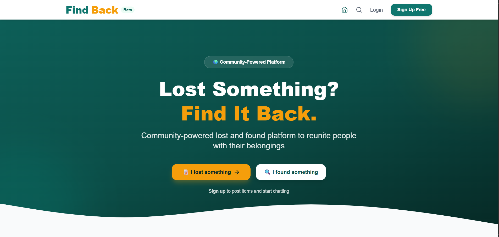

# 🏷️ FindBack — Community Lost & Found Platform


> **FindBack** is a community-powered lost and found platform designed to help people report, discover, and recover lost items by connecting item owners with people who have found them.

Built with **React, FastAPI, Supabase, and Tailwind CSS**.

🔗 **Live Demo:** https://findback.vercel.app

---

## 📸 Screenshots

> Replace the placeholder images below with screenshots from the actual application.

| Home Page                                                        | Item Detail                                                          |
| ---------------------------------------------------------------- | -------------------------------------------------------------------- |
|  |  |

| Chat                                                   | Public Profile                                                      |
| ------------------------------------------------------ | ------------------------------------------------------------------- |
|  |  |

---

## ✨ Features

### 🔐 Authentication

* Email and password registration
* Secure user login and logout
* Supabase authentication
* Session management
* User profile creation

### 📝 Lost & Found Items

* Report lost items
* Report found items
* Add item title and description
* Add category and location
* Upload multiple item photos
* View detailed item information
* Mark items as returned
* Display returned-item status

### 🔍 Search & Discovery

* Browse lost and found items
* Search items by keyword
* Filter items by category
* Filter by location
* Filter by item type
* View item details

### 💬 Messaging

* In-app messaging between users
* Contact the owner or finder directly
* Message history associated with each item
* Chat interface inside item details
* No need to publicly expose personal contact information

### 🔔 Notifications

* Notifications for new messages
* Unread message indicators
* Notification management
* Real-time notification support

### 👤 User Profiles

* View personal profile
* Edit profile information
* Upload profile photo
* View user's posted items
* View active and returned items
* Public user profiles
* Click a user's name to view their profile

### 🎨 Modern UI

* Responsive design
* Mobile-friendly interface
* Clean and modern layout
* Tailwind CSS styling
* Card-based item browsing
* Responsive item detail pages
* Gradient hero sections
* Loading states and empty states

---

## 🛠️ Tech Stack

| Category            | Technology          | Purpose                         |
| ------------------- | ------------------- | ------------------------------- |
| **Frontend**        | React 18 + Vite     | User interface                  |
| **Styling**         | Tailwind CSS        | Responsive styling              |
| **Backend**         | FastAPI             | REST API                        |
| **Database**        | Supabase PostgreSQL | Application database            |
| **Authentication**  | Supabase Auth       | User authentication             |
| **Storage**         | Supabase Storage    | Image and profile photo storage |
| **Real-time**       | Supabase Realtime   | Real-time application updates   |
| **Icons**           | Lucide React        | UI icons                        |
| **Deployment**      | Vercel              | Frontend hosting                |
| **Backend Hosting** | Railway             | Backend hosting                 |

---

## 📁 Project Structure

```text
findback/
│
├── frontend/                       # React + Vite frontend
│   ├── src/
│   │   ├── components/             # Reusable UI components
│   │   │   └── Navbar.jsx
│   │   │
│   │   ├── context/                # React contexts
│   │   │   ├── AuthContext.jsx
│   │   │   └── NotificationContext.jsx
│   │   │
│   │   ├── pages/                  # Application pages
│   │   │   ├── Home.jsx
│   │   │   ├── Browse.jsx
│   │   │   ├── ItemDetail.jsx
│   │   │   ├── PostItem.jsx
│   │   │   ├── Chat.jsx
│   │   │   ├── Profile.jsx
│   │   │   ├── PublicProfile.jsx
│   │   │   ├── Login.jsx
│   │   │   └── Register.jsx
│   │   │
│   │   ├── services/               # Backend and Supabase services
│   │   │   └── supabase.js
│   │   │
│   │   ├── App.jsx
│   │   ├── main.jsx
│   │   └── index.css
│   │
│   ├── .env
│   └── package.json
│
├── backend/                        # FastAPI backend
│   ├── app/
│   │   └── main.py
│   ├── requirements.txt
│   └── .env
│
├── database/
│   └── schema.sql
│
└── README.md
```

---

## 🗄️ Database Schema

FindBack uses **Supabase PostgreSQL** as its primary database.

### Core Tables

```text
users
  └── Supabase Auth users

profiles
  ├── id
  ├── name
  ├── phone
  └── avatar_url

items
  ├── id
  ├── user_id
  ├── title
  ├── description
  ├── category
  ├── location
  ├── type
  ├── status
  └── photo_urls

messages
  ├── id
  ├── item_id
  ├── sender_id
  ├── receiver_id
  └── message_text

categories
  └── Item categories

reports
  └── Reported or flagged content
```

### Relationships

```text
items.user_id       → profiles.id

messages.item_id    → items.id

messages.sender_id  → profiles.id

messages.receiver_id → profiles.id
```

---

## 🚀 Installation & Setup

### Prerequisites

Make sure you have the following installed:

* Node.js 18+
* Python 3.10+
* Git
* A Supabase account

---

### 1. Clone the Repository

```bash
git clone https://github.com/rihhanna/findback.git

cd findback
```

---

### 2. Frontend Setup

```bash
cd frontend

npm install

npm run dev
```

Create a `.env` file inside the `frontend` directory:

```env
VITE_SUPABASE_URL=https://your-project.supabase.co
VITE_SUPABASE_ANON_KEY=your-anon-key
```

---

### 3. Backend Setup

Open a new terminal:

```bash
cd backend

python -m venv venv
```

#### Windows

```bash
venv\Scripts\activate
```

#### macOS / Linux

```bash
source venv/bin/activate
```

Install the dependencies:

```bash
pip install -r requirements.txt
```

Create a `.env` file inside the `backend` directory:

```env
SUPABASE_URL=https://your-project.supabase.co
SUPABASE_ANON_KEY=your-anon-key
SUPABASE_SERVICE_ROLE_KEY=your-service-role-key
```

Start the FastAPI server:

```bash
uvicorn app.main:app --reload
```

The API will be available at:

```text
http://127.0.0.1:8000
```

---

### 4. Database Setup

1. Create a project in Supabase.
2. Open the **SQL Editor**.
3. Run the SQL script located at:

```text
database/schema.sql
```

4. Configure the required Row Level Security (RLS) policies.
5. Configure Supabase Storage for item and profile images.

---

## 🔑 Environment Variables

### Frontend

```env
VITE_SUPABASE_URL=https://your-project.supabase.co
VITE_SUPABASE_ANON_KEY=your-anon-key
```

### Backend

```env
SUPABASE_URL=https://your-project.supabase.co
SUPABASE_ANON_KEY=your-anon-key
SUPABASE_SERVICE_ROLE_KEY=your-service-role-key
```

> ⚠️ **Security:** Never commit `.env` files or expose your Supabase service-role key publicly.

---

## 🔧 Deployment

### Frontend — Vercel

Build the production application:

```bash
cd frontend

npm run build
```

Then deploy the frontend through Vercel and configure the required environment variables.

### Backend — Railway

1. Push the backend to GitHub.
2. Create a Railway project.
3. Connect the GitHub repository.
4. Configure the required environment variables.
5. Deploy the FastAPI application.

---

## 📖 API Endpoints

| Method | Endpoint              | Description        |
| ------ | --------------------- | ------------------ |
| GET    | `/`                   | API status         |
| GET    | `/health`             | Health check       |
| POST   | `/auth/signup`        | Register a user    |
| POST   | `/auth/login`         | Login              |
| POST   | `/auth/logout`        | Logout             |
| GET    | `/items`              | Get items          |
| POST   | `/items`              | Create an item     |
| GET    | `/items/{id}`         | Get an item        |
| PUT    | `/items/{id}`         | Update an item     |
| DELETE | `/items/{id}`         | Delete an item     |
| GET    | `/messages/{item_id}` | Get item messages  |
| POST   | `/messages`           | Send a message     |
| GET    | `/profiles/{user_id}` | Get a user profile |

---

## 🔮 Future Enhancements

### v2.0

* [ ] 🤖 AI-powered image matching
* [ ] 🔎 Smart semantic search with embeddings
* [ ] 🗺️ Map-based lost and found discovery
* [ ] 🔔 Push notifications
* [ ] 🌙 Dark mode
* [ ] 📱 Mobile application with React Native
* [ ] 🛡️ Admin moderation dashboard
* [ ] 🏷️ QR codes for pet tags and ID cards
* [ ] 💝 Reward and thank-you system
* [ ] 📊 Advanced analytics dashboard

---

## 🤝 Contributing

Contributions are welcome!

1. Fork the repository.
2. Create a feature branch:

```bash
git checkout -b feature/AmazingFeature
```

3. Commit your changes:

```bash
git commit -m "Add some AmazingFeature"
```

4. Push to your branch:

```bash
git push origin feature/AmazingFeature
```

5. Open a Pull Request.

---

## 📄 License

This project is licensed under the **MIT License**.

See the `LICENSE` file for more information.

---

## 👩‍💻 Author

### Rehana Hassan Muhamed

Software Engineering graduate passionate about **Data Analytics, Machine Learning, and Software Development**.

* 💻 GitHub: [@rihhanna](https://github.com/rihhanna)
* 💼 LinkedIn: [Rehana Hassan](https://linkedin.com/in/rehana-hassan)

---

## 🙏 Acknowledgments

Special thanks to the tools and technologies that made FindBack possible:

* [Supabase](https://supabase.com) — Database, authentication, storage, and realtime functionality
* [React](https://react.dev) — Frontend framework
* [FastAPI](https://fastapi.tiangolo.com) — Backend API framework
* [Tailwind CSS](https://tailwindcss.com) — UI styling
* [Vercel](https://vercel.com) — Frontend deployment
* [Railway](https://railway.app) — Backend deployment
* [Lucide](https://lucide.dev) — Icons

---

## 📊 Project Status

| Phase            | Status         |
| ---------------- | -------------- |
| MVP Development  | ✅ Complete     |
| Core Features    | ✅ Complete     |
| Authentication   | ✅ Complete     |
| Item Management  | ✅ Complete     |
| Messaging        | ✅ Complete     |
| User Profiles    | ✅ Complete     |
| Testing          | 🔄 In Progress |
| Production       | 🚀 Live        |
| v2.0 AI Features | ⏳ Planned      |

---

## 🔗 Quick Links

* 🌐 **[Live Demo](https://findback.vercel.app)**
* 💻 **[GitHub Repository](https://github.com/rihhanna/findback)**
* 🐛 **[Report an Issue](https://github.com/rihhanna/findback/issues)**

---

## 💬 Support

If you encounter a problem or have a suggestion:

* Open an issue on GitHub
* Submit a pull request
* Contact: **[hrihhana@gmail.com](mailto:hrihhana@gmail.com)**

---

> **"I don't just study AI and Machine Learning. I build with it."** 🚀

---

### Made with ❤️ by Rehana Hassan
